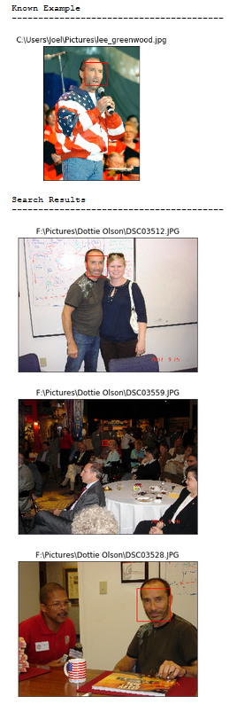

# FaceDB
Find and group faces in a database of images


## Current State
### Processing Database
Before you can query your collection of images you must first process them all. This entails finding and extracting feature vectors from all faces found in your collection of images.

```
import faceFinder

path = "C:/path/to/images/folder"
faceFinder.process_images(path)
```
* Path may have sub-directories, `process_images()` will find all `.jpg` and `.png` files within
* `process_images()` will create `faces.pkl` and `processed_images.pkl`
* `faces.pkl` contains feature vectors, bboxs, and image paths for all faces
* `processed_images.pkl` is just a dict of image paths used to avoid processing the same image multiple times

### Querying Database
A query in this context means asking for all images containing a certain person. The way faceFinder achieves this is by using a known reference image. For example, I know that my dataset has a few images of Lee Greenwood, so if I want to find those images I can provide a known image of Lee Greenwood and faceFinder will return the `n` closest faces to the one provided.

```
im = r'C:\Users\Joel\Pictures\lee_greenwood.jpg'
# Photographer
# -Yoland Hunter (U.S. Air Force)
# -https://www.af.mil/News/Photos/igphoto/2000030155/

fnames, bboxs = ff.find_similar(im,3,True)
for i in range(len(fnames)):
    ff.show_bboxs(fnames[i], bboxs[i])
```



## Project Outline
### What
 * This _hopefully_ will be a program which, given a database of images, will find all faces within, create a _unique_ identifier for each individual, allow the user to (select individuals within a picture, assign a name to them, and search for other images containing that person)
 * If, for example, you want to find the image of you and Obama at Comic-Con last year you would provide a picture of you, and a picture of Obama and query the dataset for images containing both you and Obama. The goal is to reduce the number of images you need to sift through to find the one you want
### Why
 * We have a large set of images from various events. We want the ability to search for all images containing a particular person.
### How
 * I intend to use [OpenCv](https://opencv.org/) for all face detection and labeling. 
 * The user interface will probably be browser-based, though I'm considering using PyQT.

 
 ### References
 * [[1]](https://www.pyimagesearch.com/2018/09/24/opencv-face-recognition/) Tutorial for face recognition with OpenCv
 * [[2]](https://github.com/opencv) OpenCV github for trained face detection model
 * [[3]](https://cmusatyalab.github.io/openface/models-and-accuracies/) OpenFace for trained face embedding model
